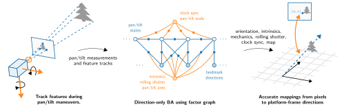

### Achieving Sub-Pixel Platform Accuracy with Pan-Tilt-Zoom Cameras in Uncertain Times
Authors: **M. V. Larsen**, K. Mathiassen (martin-vonheim.larsen (a) ffi.no)

&nbsp;[](https://opensource.org/license/mit) [](https://doi.org/10.1109/TRO.2024.3508141)

In this article, we present a novel method for self-calibrating a pan–tilt–zoom (PTZ) camera system model, specifically suited for long-range multitarget tracking with maneuvering low-cost PTZ cameras. Traditionally, such camera systems cannot provide accurate mappings from pixels to directions in the platform frame due to imprecise pan/tilt measurements or lacking synchronization between the pan/tilt unit and the video stream. Using a direction-only bundle adjustment (BA) incorporating pan/tilt measurements, we calibrate camera intrinsics, rolling shutter characteristics, and pan/tilt mechanics, and obtain clock synchronization between the video stream and pan/tilt telemetry. We call the resulting method pan/tilt camera extrinsic and intrinsic estimation (PTCEE). In a thorough simulation study, we show that the proposed estimation scheme identifies model parameters with subpixel precision across a wide range of camera setups. Leveraging the map of landmarks from the BA, we propose a method for estimating camera orientation in real-time, and demonstrate pixel-level mapping precision on real-world data. Through the proposed calibration and orientation schemes, PTCEE enables high-precision target tracking during camera maneuvers in many low-cost systems, which was previously reserved for high-end systems with specialized hardware.



The full paper can be found at [DOI: 10.1109/TRO.2024.3508141](https://doi.org/10.1109/TRO.2024.3508141)

The [ptcee](https://github.com/ffi-no/ptcee)
library contains the code needed for performing the direction-only bundle
adjustment (BA) used in the paper.  This repository contains the additional
code needed to perform the Monte Carlo (MC) simulations from sections V.A and
V.B in the paper.

### Reproducing the simulated experiments
Running the simulations and generating the results takes 20 - 60 min, depending
on what hardware you are using. We recommend building using Docker, as this
will be straight-forward on most machines. If you want to adjust parameters or
modify the code we recommend following the manual approach.

<details>
  <summary>Generate results using Docker</summary>

Make sure to have [Docker](https://www.docker.com/) installed.

```bash
docker build -t ptcee-paper .

docker run --rm -v $(pwd)/results:/root/results ptcee-paper /bin/bash -c "cd /root/results \
         && /root/Paper-ptz-subpix-accuracy/build/Release/base_ptcee_mc $(nproc) 10000 base-ptcee-mc.dat \
         && /root/Paper-ptz-subpix-accuracy/build/Release/soft_ptcee_mc $(nproc) 10000 soft-ptcee-mc.dat \
         && /root/Paper-ptz-subpix-accuracy/build/Release/multi_level_ba_mc $(nproc) 128 multi-level-ba \
         && python /root/Paper-ptz-subpix-accuracy/python/print-tables.py base-ptcee-mc.dat soft-ptcee-mc.dat > tables.txt \
         && python /root/Paper-ptz-subpix-accuracy/python/generate-plots.py base-ptcee-mc.dat soft-ptcee-mc.dat \
         && python /root/Paper-ptz-subpix-accuracy/python/multi-level-ba-tables.py multi-level-ba > multi-level-ba-table.tex \
         && python /root/Paper-ptz-subpix-accuracy/python/multi-level-ba-plot.py multi-level-ba"

```
The `results` directory should now contain the following files:
- `multi-level-ba-table.tex` (with table I as latex)
- `tables.txt` (with table II and III as raw text)
- `base-ptcee-f-hist.pdf` (fig 6.a)
- `base-ptcee-k-hist.pdf` (fig 6.b)
- `base-ptcee-d-hist.pdf` (fig 6.c)
- `base-ptcee-ell-hist.pdf` (fig 6.d)
- `base-ptcee-mepe-hist.pdf` (fig 7)
- `soft-ptcee-rel-f-err.pdf` (fig 8)
- `multi-level-ba-compare.pdf` (fig 10)
</details>
<details>
  <summary>Build and generate results manually</summary>
The following instructions are intended to work on Ubuntu 24.04, but should
work on your operating system of choice. Make sure to use Python 3 and a
fairly recent compiler (GCC >= 8).

<details>
  <summary>Step 1: Install GCC, Python 3 as default, CMake and Git</summary>

```bash
[sudo] apt update
[sudo] apt install build-essential python3-pip python-is-python3 cmake
```
</details>

<details>
  <summary>Step 2: Setup conan 2</summary>

If you haven't already, head over to [conan.io](conan.io) and follow updated
install instructions from there.

At the time of writing, the following gets you setup:
```bash
pip install conan
conan profile new $HOME/.conan/profiles/default --detect
conan profile update settings.compiler.libcxx=libstdc++11 default
```
</details>

<details>
  <summary>Step 3: Download and export ptcee</summary>

```bash
cd /tmp
git clone https://github.com/ffi-no/ptcee.git /tmp
conan export /tmp/ptcee
rm -rf /tmp/ptcee
```
</details>

<details>
  <summary>Step 4: Build</summary>

```bash
git clone https://github.com/marvonlar/Paper-ptz-subpix-accuracy.git
cd Paper-ptz-subpix-accuracy
conan build . -bmissing
cd build
cmake .. -DCMAKE_BUILD_TYPE=RELEASE
cmake --build . -- -j$(nproc)
cd ..
```
</details>

<details>
  <summary>Step 5: Generate results</summary>

```bash
build/Release/base_ptcee_mc $(nproc) 10000 base-ptcee-mc.dat
build/Release/soft_ptcee_mc $(nproc) 10000 soft-ptcee-mc.dat
build/Release/multi_level_ba_mc $(nproc) 128 multi-level-ba

pip install -r python/requirements.txt

python python/print-tables.py base-ptcee-mc.dat soft-ptcee-mc.dat
# prints table II and III and NMEPEs
python python/generate-plots.py base-ptcee-mc.dat soft-ptcee-mc.dat
# generates fig 6.a as base-ptcee-f-hist.pdf
#           fig 6.b as base-ptcee-k-hist.pdf
#           fig 6.c as base-ptcee-d-hist.pdf
#           fig 6.d as base-ptcee-ell-hist.pdf
#           fig 7   as base-ptcee-mepe-hist.pdf
#           fig 8   as soft-ptcee-rel-f-err.pdf
python python/multi-level-ba-tables.py multi-level-ba
# prints table I
python python/multi-level-ba-plot.py multi-level-ba
# generates fig 10 as multi-level-ba-compare.pdf
```
</details>
</details>

## License

Source code is licensed under the [MIT
License](https://opensource.org/licenses/MIT). See [LICENSE](LICENSE).

### Citation

Please cite the Paper as:

> Larsen, Martin Vonheim, and Kim Mathiassen. "Achieving Sub-Pixel Platform Accuracy With Pan-Tilt-Zoom Cameras in Uncertain Times." IEEE Transactions on Robotics (2024).

Bibtex entry as follows:

```
@article{larsen2024achieving,
  title={Achieving Sub-Pixel Platform Accuracy With Pan-Tilt-Zoom Cameras in Uncertain Times},
  author={Larsen, Martin Vonheim and Mathiassen, Kim},
  journal={IEEE Transactions on Robotics},
  year={2024},
  publisher={IEEE}
}
```
